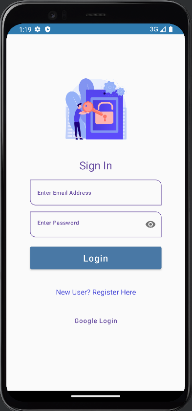
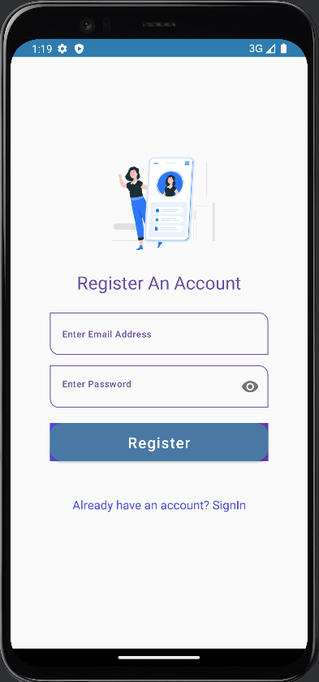
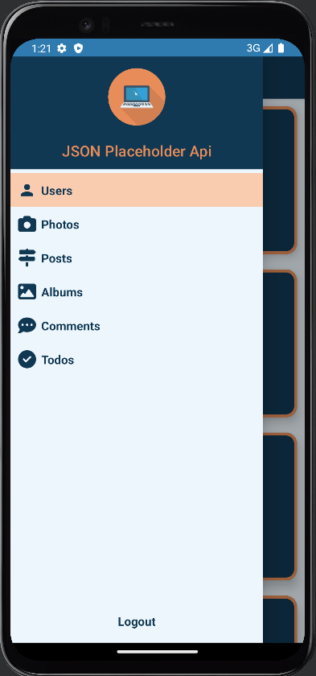
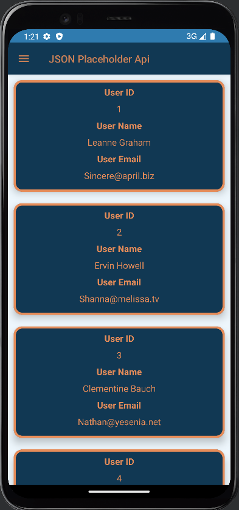
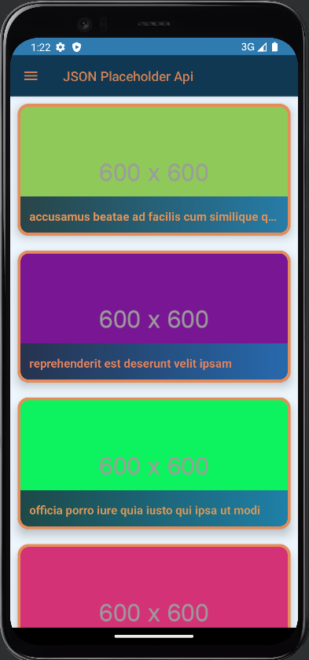
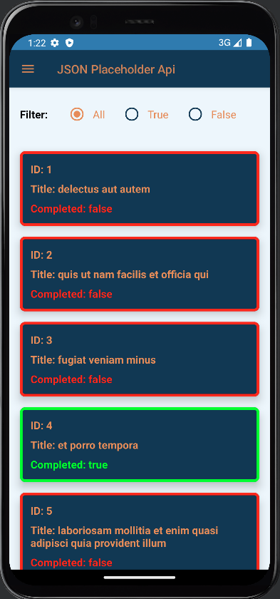

# JSON Placeholder Api

JSON Placeholder Api is an User and post Api.

This Api as:

* Users
* Photos
* Posts
* Albums
* Comments
* Todos

  
  
  
  
  
  
  
  

JSON Placeholder Api is still under development in testing

Libraries:
* Compose Toolkit
* Hilt
* Dependency Injection
* Kotlin Coroutines
* Firebase Authentication 

Copyright 2023 Praveen Krishnamoorthy

